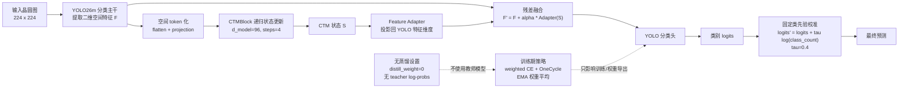

# 无蒸馏 YoloCTM 空间残差适配方法用于长尾晶圆图缺陷分类

## 摘要

WM-811K 晶圆图缺陷分类同时面临空间形态依赖和类别长尾分布问题。普通图像分类模型容易偏向数量占优的 `none` 类，并且对 `Scratch`、`Loc`、`Edge-Loc` 等依赖空间位置和形状的少数类缺陷识别不稳定。本文实现一种无教师蒸馏的 YoloCTM 方法：以 YOLO 分类模型作为主干，加入轻量 CTM 空间递归残差适配器，并结合 EMA 权重平均、固定类先验校准和 OneCycle 强后期退火训练策略。在不使用教师模型、集成模型或测试集反馈的前提下，当前最佳 10 epoch 验证结果达到 macro F1 0.9092，为后续无蒸馏晶圆图分类研究提供了一个更干净的基线方案。

## 1. 引言

晶圆图缺陷分类不同于普通自然图像分类。许多缺陷类别并不只由局部纹理决定，而是由缺陷点在晶圆中的空间分布决定。例如，边缘型缺陷集中在外圈区域，中心型缺陷集中在晶圆中心，划痕型缺陷呈现细长轨迹。另一方面，WM-811K 数据集中 `none` 类样本远多于少数缺陷类，导致模型训练和评估容易被总体准确率掩盖。

已有蒸馏方案可以通过强教师模型提高单模型表现，但教师模型会引入额外训练依赖，也容易让方法贡献被质疑为主要来自教师。为此，本文关注无蒸馏设置，目标是在不使用教师软标签的情况下，提高 YoloCTM 学生模型本身的长尾分类能力。

## 2. 方法

图 1 给出了当前无蒸馏 YoloCTM 的整体网络结构。需要强调的是，EMA、OneCycle 和类先验校准不引入新的推理分支；推理阶段实际执行的是 YOLO 主干、CTM 空间残差适配器和分类头。



**图 1  无蒸馏 YoloCTM 空间残差适配网络结构。**

### 2.1 YoloCTM 空间残差适配器

模型首先使用预训练 YOLO 分类网络提取二维空间特征图。随后将特征图展平为空间 token 序列，并输入 CTM 风格的递归状态更新模块。CTM 模块通过多步状态更新建模空间 token 之间的上下文关系。

设 YOLO 主干输出特征为 `F`，CTM 更新后的空间状态为 `S`。方法将 `S` 投影回 YOLO 特征维度，形成残差修正项：

```text
F' = F + alpha * Adapter(S)
```

最终分类头在修正后的 `F'` 上输出类别 logits。该设计保留 YOLO 主干的稳定分类能力，同时允许 CTM 分支补充晶圆缺陷的空间形态信息。

### 2.2 无蒸馏训练

当前无蒸馏方案显式关闭教师模型：

```text
distill_logprobs = null
distill_weight = 0.0
```

训练损失使用加权交叉熵，以缓解类别不均衡。与蒸馏方案相比，该设置不依赖集成教师、不需要额外生成 teacher log-probs，也不会在推理阶段引入任何教师分支。

### 2.3 EMA 权重平均

训练过程中额外维护指数滑动平均权重：

```text
W_ema = decay * W_ema + (1 - decay) * W_current
```

当前设置 `decay = 0.999`。EMA 只影响训练期的权重导出与验证，不增加推理参数量，也基本不增加单张图推理时间。其作用是平滑训练过程中的参数抖动，提高少数类边界的稳定性。

### 2.4 类先验校准

针对长尾类别偏置，验证和指标计算时使用固定类先验 logit 校准：

```text
logits' = logits + tau * log(class_count)
```

当前无蒸馏最佳方案使用 `tau = 0.4`。该操作不改变模型结构，只是在输出 logits 上加入固定偏置，用于调整 precision 与 recall 的平衡。

### 2.5 OneCycle 强后期退火

无蒸馏模型在 10 epoch 固定预算下存在欠收敛迹象。为在不增加训练轮数的情况下改善收敛，当前最佳方案采用 OneCycle 学习率调度：

```text
max_lr = 0.00125
onecycle_final_div_factor = 1000
```

该策略前期使用适度较高学习率加快探索，后期通过更强退火降低学习率，使最后阶段权重更加稳定。与延长到 20 或 30 epoch 相比，该方案保持 10 epoch 预算不变。

## 3. 实验结果

实验使用 WM-811K 九分类图像文件夹数据，图像尺寸为 224，训练轮数限制为 10 epoch，评估过程不读取测试集，只在验证集上筛选无蒸馏候选。

| 方法 | Epoch | 参数量 | Val Acc | Val Macro P | Val Macro R | Val Macro F1 |
|---|---:|---:|---:|---:|---:|---:|
| 无蒸馏 EMA，tau=0.1 | 10 | 10.525M | 0.9737 | 0.8398 | 0.9321 | 0.8822 |
| 无蒸馏 EMA，tau=0.4 | 10 | 10.525M | 0.9798 | 0.9040 | 0.9032 | 0.9028 |
| OneCycle，max_lr=0.00125 | 10 | 10.525M | 0.9810 | 0.8975 | 0.9093 | 0.9031 |
| OneCycle，max_lr=0.00125，final_div=1000 | 10 | 10.525M | 0.9818 | 0.9127 | 0.9062 | 0.9092 |

结果显示，固定类先验校准显著改善无蒸馏模型的 precision/recall 平衡；OneCycle 调度进一步提高 10 epoch 内的收敛质量；更强后期退火将验证 macro F1 提升到 0.9092。

## 4. 讨论

该方案的主要价值在于无教师、无集成、无额外推理分支。EMA、OneCycle 和类先验校准均为训练或输出层面的策略，不会使推理阶段相比同结构 YoloCTM 变慢。真正影响单图速度的是 YoloCTM 相比纯 YOLO 多出的 CTM 空间递归残差分支，因此后续仍需单独报告 latency、FPS 与 FLOPs。

从创新性角度看，YoloCTM 空间残差结构并非全新神经网络范式，更适合作为面向晶圆图空间缺陷模式的任务适配结构。当前无蒸馏方案的创新重点在于：将轻量空间残差适配、长尾类先验校准、EMA 稳定化和短预算强退火训练组合成一个干净的无教师长尾分类协议。

## 5. 结论

本文实现并验证了一条无蒸馏 YoloCTM 路线。在固定 10 epoch、无教师模型、无测试集反馈的条件下，最佳验证 macro F1 达到 0.9092。该结果说明，YoloCTM 不必完全依赖教师蒸馏即可获得较强长尾分类表现。后续工作应补充纯 YOLO 与 YoloCTM 的推理速度对比、跨数据集验证，以及更具晶圆结构先验的空间建模机制。

## 6. 后续深度创新候选：晶圆拓扑感知 Token Mixer

当前已经实现一个更偏结构创新的候选方向：`WaferTopologyMixer`。该模块不再只把 YOLO 特征图简单展平成 token，也不只加入极坐标数值，而是显式利用晶圆图的拓扑结构，在 CTM 状态更新前构造三类上下文：

```text
ring context   : 同一半径环带内的平均 token 表征
sector context : 同一角向扇区内的平均 token 表征
global context : 全晶圆平均 token 表征
```

然后将当前 token、环带上下文、扇区上下文、全局上下文以及可学习的环带/扇区嵌入拼接，经轻量 MLP 产生拓扑残差：

```text
T' = T + beta * Gate(T, G) * MLP([T, R, S, U, G])
```

其中 `T` 是原始空间 token，`R` 是 ring context，`S` 是 sector context，`U` 是 global context，`G` 是 ring/sector geometry embedding。该模块的最后一层采用零初始化，使模型初始行为接近当前 best baseline，训练时再逐步学习是否使用拓扑上下文。

这个候选的论文动机更强：晶圆缺陷类别天然具有环带性、方位性和全局覆盖差异。例如，`Center` 与 `Edge-Loc` 依赖半径位置，`Scratch` 依赖跨区域细长轨迹，`Near-full` 依赖全局覆盖程度。相比通用 token mixer，晶圆拓扑感知 mixer 直接把这些结构先验嵌入到 token 交互中，更容易形成期刊级方法叙事。

当前候选配置为：

```text
AutoResearch/configs/wm811k_autoresearch_wafer_topology.yaml
```

关键设置：

```text
token_mixer: wafer_topology
topology_ring_bins: 4
topology_sector_bins: 8
topology_hidden_mult: 1.5
```

该候选保持当前无蒸馏 best 的训练协议不变：

```text
AdamW + OneCycle max_lr=0.00125
onecycle_final_div_factor=1000
EMA decay=0.999
tau=0.4
10 epoch
test.enabled=false
```

因此它是一个单因素结构实验。若验证 macro F1 超过 `0.909208`，可以将其作为“晶圆拓扑感知空间残差适配”的主创新点；若只在某些类别上改善，则可进一步做 ring/sector 消融和类别级分析。
